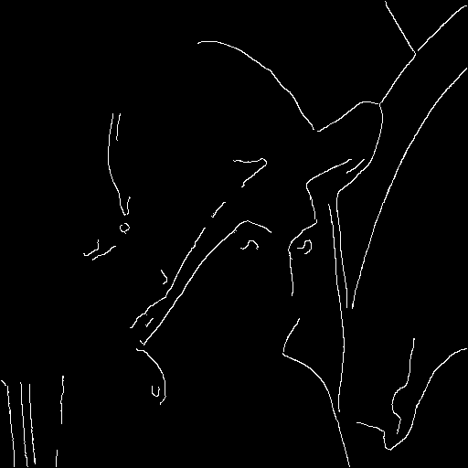

# lenna-plugins-extra-py

Some lenna plugins for python.

## 🐰 quickstart

```bash
virtualenv -p python3 .venv
source .venv/bin/activate
pip install . --use-feature=in-tree-build
pip install numpy pillow
```

Buile wheel using

```bash
maturin build --manylinux=off --cargo-extra-args="--features=python"
```

## open in python

```python
#python
from PIL import Image
from numpy import asarray
import lenna_plugins_extra_py

image = Image.open('../lenna.png')
data = asarray(image)

config = lenna_plugins_extra_py.denoise.default_config()
processed = lenna_plugins_py.denoise.process(config, data)
Image.fromarray(processed).save('lenna_out.png')
```



## 📜 License

This software is licensed under the [MIT](https://github.com/lenna-project/lenna-plugins-extra/blob/main/LICENSE) © [lenna-project](https://github.com/lenna-project).
